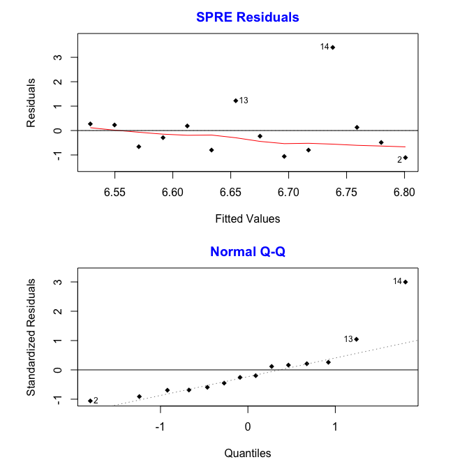
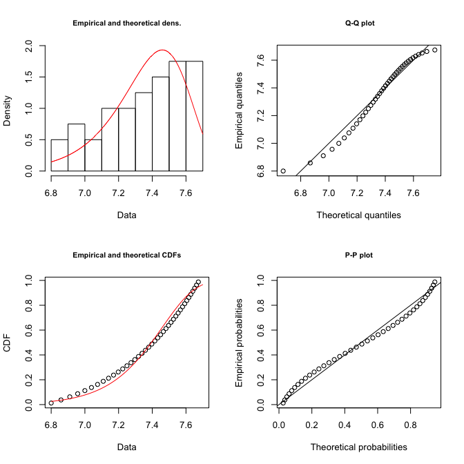

An R package for SPRE
================

In this vignette, we show two examples of SPRE analysis. The first example can be found in Weissman-Miller, D., Miller, R. J., & Shotwell, M. P. (2017), while the second example can be found in Weissman-Miller, D. (2013). The references are given as follow.

Weissman-Miller, D. (2013). Novel point estimation from a Semiparametric Ratio Estimator (SPRE): Long-term health outcomes from short-term linear data, with application to weight loss in obesity. International Journal of Biostatistics, 9(2): 175-184 DOI: <http://dx.doi.org/10.1515/ijb-2012-0049>.

Weissman-Miller, D., Miller, R. J., & Shotwell, M. P. (2017). Translational Research for Occupational Therapy: Using SPRE in Hippotherapy for Children with Developmental Disabilities. Occupational therapy international, 2017.

First example
-------------

### Load package

``` r
library(SPRE)
```

### Load HEAT data

``` r
data("HEAT_stat")
```

### Step 1: Determining the most significant F statistic by stepwise regression

``` r
skip_indices<-1:2
step_reg<-stepwise_regression(HEAT_stat$Session,HEAT_stat$FData,skip_indices)
#>       No.  x Rsquare  Fstat FstatNum. FstatDen. Pvalue  betahat
#>  [1,]   1  9      --     --        --        --     --       --
#>  [2,]   2 14      --     --        --        --     --       --
#>  [3,]   3  6 0.34214 0.5201         1         1 0.6022 -0.01469
#>  [4,]   4  3 0.64871 3.6932         1         2 0.1946 -0.02154
#>  [5,]   5 10 0.31163 1.3581         1         3 0.3281 -0.01710
#>  [6,]   6 13 0.02148 0.0878         1         4 0.7817  0.00813
#>  [7,]   7  4 0.02901 0.1494         1         5 0.7150 -0.01053
#>  [8,]   8  8 0.02562 0.1578         1         6 0.7050 -0.01223
#>  [9,]   9  2 0.19166 1.6597         1         7 0.2386 -0.03928
#> [10,]  10  1 0.32983 3.9372         1         8 0.0825 -0.05377
#> [11,]  11  5 0.32821 4.3971         1         9 0.0654 -0.05888
#> [12,]  12 12 0.12305 1.4032         1        10 0.2636 -0.03724
#> [13,]  13  7 0.06803 0.8030         1        11 0.3894 -0.03896
#> [14,]  14 11 0.00559 0.0675         1        12 0.7994  0.02093
#> Potential change point: tau = 5 
#> Largest Fstat: Fstat = 4.397116 
#> Index of potential change point: No. = 11
```

### Step 2: Evaluating the change point and estimating parameter

Here, the change point is identified as the 11th index.

``` r
SPRE_mod<-SPRE(step_reg,chptidx=11,lastidx=14)
#> Change point: tau = 5 
#> Fstat at change point: Fstat = 4.397116 
#> Index of change point: No. = 11 
#> Betahat: 0.02092615 
#> Shape parameter: 0.1105191
```

### Step 3: Estimating/predicting long-term outcomes

We will need to supply the following things to the function:

-   Times/sessions the predictions will be evaluated at: xpred

-   Shape parameter: kshape

-   Change point: tau

-   Prior response: theta1

``` r
kshape<-SPRE_mod$kshape
idxmaxFstat<-which.max(SPRE_mod$step_reg$fDist[,"Fstat"])
tau<-SPRE_mod$step_reg$fDist[idxmaxFstat,"x"]
theta1<-HEAT_stat$FData[SPRE_mod$chptidx]
xpred<-7:46
SPRE_pred<-predict_SPRE(xpred=xpred,kshape=kshape,tau=tau,
                        theta1=theta1,predtype="rolling")
#>       No. xpred tau  R Ratio  Theta_t
#>  [1,]   0     5  NA       NA       NA
#>  [2,]   1     7   5 1.000000 6.800000
#>  [3,]   2     8   5 1.008588 6.858401
#>  [4,]   3     9   5 1.007576 6.910357
#>  [5,]   4    10   5 1.006777 6.957186
#>  [6,]   5    11   5 1.006130 6.999834
#>  [7,]   6    12   5 1.005596 7.039009
#>  [8,]   7    13   5 1.005148 7.075247
#>  [9,]   8    14   5 1.004767 7.108972
#> [10,]   9    15   5 1.004438 7.140518
#> [11,]  10    16   5 1.004151 7.170159
#> [12,]  11    17   5 1.003899 7.198117
#> [13,]  12    18   5 1.003676 7.224580
#> [14,]  13    19   5 1.003478 7.249704
#> [15,]  14    20   5 1.003299 7.273622
#> [16,]  15    21   5 1.003138 7.296448
#> [17,]  16    22   5 1.002992 7.318280
#> [18,]  17    23   5 1.002859 7.339203
#> [19,]  18    24   5 1.002737 7.359294
#> [20,]  19    25   5 1.002626 7.378617
#> [21,]  20    26   5 1.002523 7.397230
#> [22,]  21    27   5 1.002427 7.415187
#> [23,]  22    28   5 1.002339 7.432532
#> [24,]  23    29   5 1.002257 7.449307
#> [25,]  24    30   5 1.002181 7.465551
#> [26,]  25    31   5 1.002109 7.481296
#> [27,]  26    32   5 1.002042 7.496573
#> [28,]  27    33   5 1.001979 7.511410
#> [29,]  28    34   5 1.001920 7.525833
#> [30,]  29    35   5 1.001864 7.539865
#> [31,]  30    36   5 1.001812 7.553527
#> [32,]  31    37   5 1.001762 7.566838
#> [33,]  32    38   5 1.001715 7.579817
#> [34,]  33    39   5 1.001671 7.592481
#> [35,]  34    40   5 1.001628 7.604845
#> [36,]  35    41   5 1.001588 7.616923
#> [37,]  36    42   5 1.001550 7.628729
#> [38,]  37    43   5 1.001513 7.640275
#> [39,]  38    44   5 1.001479 7.651572
#> [40,]  39    45   5 1.001445 7.662632
#> [41,]  40    46   5 1.001414 7.673465
```

### Additional analyses and checks

#### Residuals plot

``` r
plot_residuals(SPRE_mod)
```



#### Plot probability distribution

``` r
plot_probability(SPRE_mod,SPRE_pred,xmin=2)
```


#### Plot things to check weibull distribution

``` r
plot_weibull(SPRE_mod,SPRE_pred)
```



#### Check prediction stability

``` r
prediction_stability(SPRE_pred)
#> Predictions, significant digits = 2, rows = 1:20
#> No duplicate found 
#>       Prediction Duplicate
#>  [1,]   NA       --       
#>  [2,] 6.80       --       
#>  [3,] 6.86       --       
#>  [4,] 6.91       --       
#>  [5,] 6.96       --       
#>  [6,] 7.00       --       
#>  [7,] 7.04       --       
#>  [8,] 7.08       --       
#>  [9,] 7.11       --       
#> [10,] 7.14       --       
#> [11,] 7.17       --       
#> [12,] 7.20       --       
#> [13,] 7.22       --       
#> [14,] 7.25       --       
#> [15,] 7.27       --       
#> [16,] 7.30       --       
#> [17,] 7.32       --       
#> [18,] 7.34       --       
#> [19,] 7.36       --       
#> [20,] 7.38       --
```

Second example
--------------

### Load package

``` r
library(SPRE)
```

### Input data

``` r
x<-c(0,0.25,0.5,1.0,1.5,1.75,2.0,2.5,3.0,3.5,4.0,4.5,5.0,5.5,6.0,6.5,7.0,7.5,8.0,9.0,10.0)
y<-c(0,0.5,1.0,2.5,3.5,4.5,6.0,6.5,7.5,8.0,9.0,9.5,
     10.0,10.5,11.0,10.8,10.75,10.6,10.5,10.4,10.25)
skip_indices<-c(1:6,12,14,16,18,20)
```

### Step 1: Determining the most significant F statistic by stepwise regression

``` r
step_reg<-stepwise_regression(x,y,skip_indices)
#>       No.     x Rsquare Fstat FstatNum. FstatDen.   Pvalue betahat
#>  [1,]   1  0.00      --    --        --        --       --      --
#>  [2,]   2  0.25      --    --        --        --       --      --
#>  [3,]   3  0.50      --    --        --        --       --      --
#>  [4,]   4  1.00      --    --        --        --       --      --
#>  [5,]   5  1.50      --    --        --        --       --      --
#>  [6,]   6  1.75      --    --        --        --       --      --
#>  [7,]   7  2.00   0.975 198.1         1         5 3.26e-05    2.83
#>  [8,]   8  2.50   0.982 323.5         1         6 1.90e-06    2.75
#>  [9,]   9  3.00   0.984 432.8         1         7 1.49e-07    2.65
#> [10,]  10  3.50   0.977 346.1         1         8 7.19e-08    2.48
#> [11,]  11  4.00   0.977 380.3         1         9 1.13e-08    2.36
#> [12,]  12  4.50      --    --        --        --       --      --
#> [13,]  13  5.00   0.967 320.2         1        11 1.76e-09    2.11
#> [14,]  14  5.50      --    --        --        --       --      --
#> [15,]  15  6.00   0.957 289.3         1        13 2.90e-10    1.90
#> [16,]  16  6.50      --    --        --        --       --      --
#> [17,]  17  7.00   0.924 182.7         1        15 8.35e-10    1.65
#> [18,]  18  7.50      --    --        --        --       --      --
#> [19,]  19  8.00   0.875 119.0         1        17 4.27e-09    1.41
#> [20,]  20  9.00      --    --        --        --       --      --
#> [21,]  21 10.00   0.784  69.1         1        19 9.43e-08    1.12
#> Potential change point: tau = 3 
#> Largest Fstat: Fstat = 432.7621 
#> Index of potential change point: No. = 9
```

### Step 2: Evaluating the change point and estimating parameter

The change point is identified as the 11th index.

``` r
SPRE_mod<-SPRE(step_reg,chptidx=11)
#> Change point: tau = 4 
#> Fstat at change point: Fstat = 380.3271 
#> Index of change point: No. = 11 
#> Betahat: 2.359565 
#> Shape parameter: 2.132776
```

### Step 3: Estimating/predicting long-term outcomes

``` r
kshape<-SPRE_mod$kshape
idxmaxFstat<-which.max(SPRE_mod$step_reg$fDist[,"Fstat"])
tau<-SPRE_mod$step_reg$fDist[idxmaxFstat,"x"]
theta1<-y[SPRE_mod$chptidx]
xpred<-c(4,4.5,5,5.5,6,7,8,9,10)
SPRE_pred<-predict_SPRE(xpred=xpred,
                        kshape=kshape,tau=tau,theta1=theta1)
#>       No. xpred tau  R Ratio   Theta_t
#>  [1,]   0   3.0  NA       NA        NA
#>  [2,]   1   4.0   3 1.000000  9.000000
#>  [3,]   2   4.5   3 1.076748  9.690735
#>  [4,]   3   5.0   3 1.046201 10.138459
#>  [5,]   4   5.5   3 1.026332 10.405429
#>  [6,]   5   6.0   3 1.014093 10.552068
#>  [7,]   6   7.0   3 1.010325 10.661015
#>  [8,]   7   8.0   3 1.001960 10.681913
#>  [9,]   8   9.0   3 1.000274 10.684834
#> [10,]   9  10.0   3 1.000028 10.685132
```

### Additional analyses and checks

#### Residuals plot

``` r
plot_residuals(SPRE_mod)
```


#### Plot probability distribution

``` r
plot_probability(SPRE_mod,SPRE_pred,xmin=2)
```


#### Plot things to check weibull distribution

``` r
plot_weibull(SPRE_mod,SPRE_pred)
```


#### Check prediction stability

``` r
prediction_stability(SPRE_pred,npred=length(xpred))
#> Predictions, significant digits = 2, rows = 1:9
#> First predicted duplicate value:10.68
#>       Prediction Duplicate
#>  [1,]    NA      --       
#>  [2,]  9.00      --       
#>  [3,]  9.69      --       
#>  [4,] 10.14      --       
#>  [5,] 10.41      --       
#>  [6,] 10.55      --       
#>  [7,] 10.66      --       
#>  [8,] 10.68      **       
#>  [9,] 10.68      --
```
